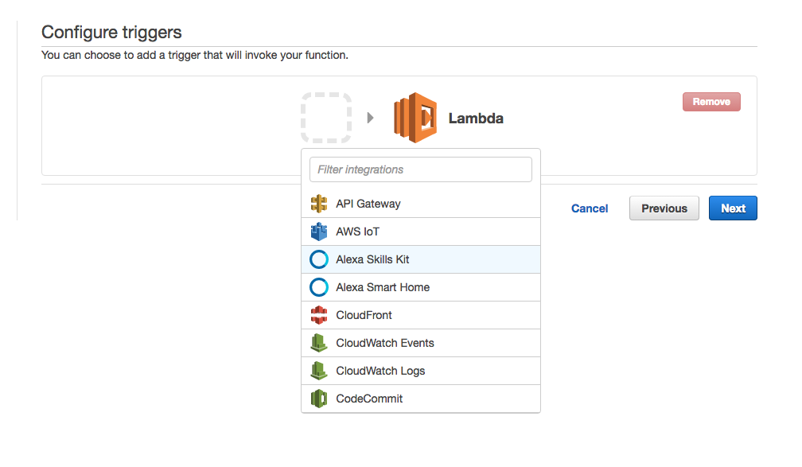
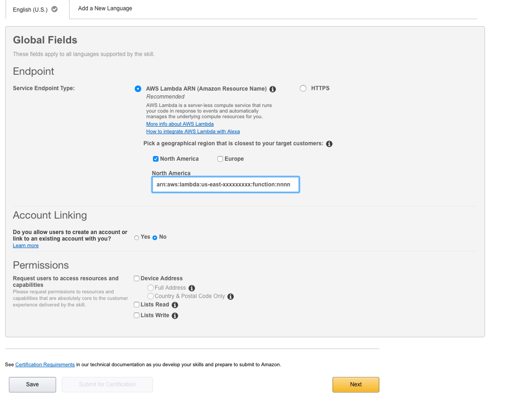

# Heatermeter Alexa Skill
This is a simple Amazon Alexa Skill for integrating with the [Heatermeter](https://github.com/CapnBry/HeaterMeter/wiki) barbeque control system.

## Prerequisites ##
1. A Heatermeter running at least version 4.x of the heatermeter software (API version 1).  
    - See [Accessing Raw Data Remotely](https://github.com/CapnBry/HeaterMeter/wiki/Accessing-Raw-Data-Remotely)
    - You can see your api version by accessing the following url: [http://<< heatermeter >>/cgi-bin/luci/lm/api/version](http://<heatermeter>/cgi-bin/luci/lm/api/version) - you should see a response similar to this:
        ```
        {
            ucid: "20170513B",
            api: 1
        }
        ```
2. Your Heatermeter needs to be accessible to from the internet.  See [Dynamic DNS (Setting External Host Name)](https://github.com/CapnBry/HeaterMeter/wiki/Dynamic-DNS-(Setting-External-Host-Name)) for more information.  Note that some routers have Dynamic DNS built in, so you can set up DDNS there instead of the Heatermeter if you prefer.  See your router's documentation for more information.
3. Of course you'll also need an Alexa enabled device (e.g. Amazon Echo, Amazon Tap, etc.)
4. You'll also need [npm](https://www.google.com/url?sa=t&rct=j&q=&esrc=s&source=web&cd=1&cad=rja&uact=8&ved=0ahUKEwiy0NC-iPDUAhUFySYKHYAlDagQFggoMAA&url=https%3A%2F%2Fwww.npmjs.com%2F&usg=AFQjCNHcRudvKKNX4eMuQBtERCMyaPp85w) on your machine to pull down additional packages needed for the Lambda function. 

## Getting Started ##
This project is invoked by a [custom Alexa skill](https://developer.amazon.com/alexa), that triggers an [AWS Lambda function](https://aws.amazon.com/lambda/?sc_channel=PS&sc_campaign=acquisition_US&sc_publisher=google&sc_medium=lambda_b&sc_content=lambda_e&sc_detail=aws%20lambda&sc_category=lambda&sc_segment=186623768554&sc_matchtype=e&sc_country=US&s_kwcid=AL!4422!3!186623768554!e!!g!!aws%20lambda&ef_id=VhfpXwAABGB13egb:20170704155400:s) written in nodejs.  If you are not already familiar with creating a custom Alexa skill and Lambda functions, I recommend you follow the [Alexa how-to guide for creating a sample nodejs skill](https://github.com/alexa/skill-sample-nodejs-howto).  This was my first Alexa skill, and that is the guide I followed to create this project.


Now assuming you are up to speed on Alexa and Lambda, here are the high level instructions needed to get you up and running with this project.

**Note**: *Even though I am not publishing this project to the Amazon Skills marketplace, you can still deploy it yourself under your own AWS developer account and use it on your own Alexa enabled devices as long as you use the same account, [check here](https://developer.amazon.com/public/solutions/alexa/alexa-skills-kit/docs/testing-an-alexa-skill).*

Before you begin, clone this repo to your local machine: 

    git clone https://github.com/foleymic/HeatermeterAlexaSkill.git


#### Create you Lambda Function ####
1. **Pull down required node packages**
    - From a command cd to the directory where you cloned the *HeatermeterAlexaSkill* repository.
    - get the node packages:
        `npm install LambdaFunction`
2. **Zip up the Lambda Function**  - Do not zip the folder LambdaFunction, just the contents of that folder. 
1. Sign into [aws.amazon.com](aws.amazon.com)
2. **Note: If you are new to Lambda and would like more information, visit the [Lambda Getting Started Guide](https://docs.aws.amazon.com/lambda/latest/dg/getting-started.html).**  **IMPORTANT:** For Regions (upper right), select US East (N. Virginia) for US skills and EU (Ireland) for UK/DE skills. These are the only two regions currently supported for Alexa skill development on AWS Lambda, and choosing the right region will guarantee lower latency.
3. Select **Services** in the upper left, then select **Lambda** (under **Compute**) from the navigation menu.
4. Click the **Create a Lambda function** button.
5. Click on the **Blank Function** blueprint tile.
6. **Configure triggers**  - Click on the  and select **Alexa Skills Kit** from the dropdown.



7. Click Next.
8. Give your function a **Name** and **Description**.  Be sure to select *Node.js 6.10* (or greater) for the **Runtime**
9. Under **Lambda function code**, select **Upload a .ZIP file** from the **Code entry type** dropdown and select the zip file created in **Step 2** above.
10. Add the following two **Environment variables**:
    - **KEY:** heatermeterHost  **VALUE:** *the external ip or hostname you have configured to access your heatermeter from outside your local network*
    - **KEY:** apiKey   **VALUE:** *Your heatermeters API Key.  Obtained from the configuration webui page*
11. Set your handler and role as follows:
    - Keep Handler as ‘index.handler’
    - Drop down the “Role” menu and select **“Create a new custom role”**. (Note: if you have already used Lambda you may already have a ‘lambda_basic_execution’ role created that you can use.) This will launch a new tab in the IAM Management Console.
12. Click **Next**, then **Create function**
13. Now that the function is created, AWS will generate a unique ARN (Amazon Resource Names) for this function.  This will be displayed on the top right.  We will use this later when configuring the Alexa Skill to identify which Lambda function to call when invoked.


#### Setup your Alexa Skill in the [Developer Portal](https://developer.amazon.com/) ####
1. Open a new Browser window or tab and navigate to the [Developer Portal](https://developer.amazon.com/).
2. Select Add a New Skill.  Choose `Custom Interaction Model ` as the *Skill Type*, and pick a *Name* and your *Invocation Name* for your skill (*Invocation Name* will the name you use to invoke the skill.  For example - *"Alexa, ask heatermeter what the current set point is*).  You can leave the **Global Fields** all as `No` 


3. Now click **Save**, then **Next**.
4. We now need to add the **Intent Schema** and the **Utterances**.
    - Copy the contents of [./Skill/IntentSchema.json](./Skill/IntentSchema.json) and paste into the Skill's Intent Schema section of the Developer Portal.

    
    - Copy the contents of [./Skill/Utterances.json](./Skill/Utterances.json) and paste into the Skill's Sample Utterances section of the Developer Portal.

    
5. Click **Next**.
6. Select the **Service Endpoint Type** as **AWS Lambda ARN**, then pick your geographical region and paste your Lambda's ARN in the text box.



7. Click **Next**
8. Now it's time to test.  In the Utterance textbox, try some of the [sample utterances](./Skill/Utterances.json).  For example, *"what is pit's temperature"*, or *"what is probe one temp"*.   **NOTE: when using numbers, be sure to spell them out**.

## TODO ##
- [ ] Better error and exception handling
- [ ] "Are you sure" prompt when changing the temperature.
- [ ] Unit tests - look at [lambda-tester](https://www.linkedin.com/pulse/unit-testing-aws-lambda-functions-nodejs-richard-hyatt)
- [ ] Use DynamoDB (or some other db) [to save state](https://github.com/alexa/alexa-skills-kit-sdk-for-nodejs#persisting-skill-attributes-through-dynamodb) - I would like to be able to capture cooking time with this skill.  
    - For example: 
        - "Alexa, tell heatermeter I put the food on the grill (now, or 5 minutes ago)"
        - "Alexa, ask heatermeter - how long has the food been on the grill"

